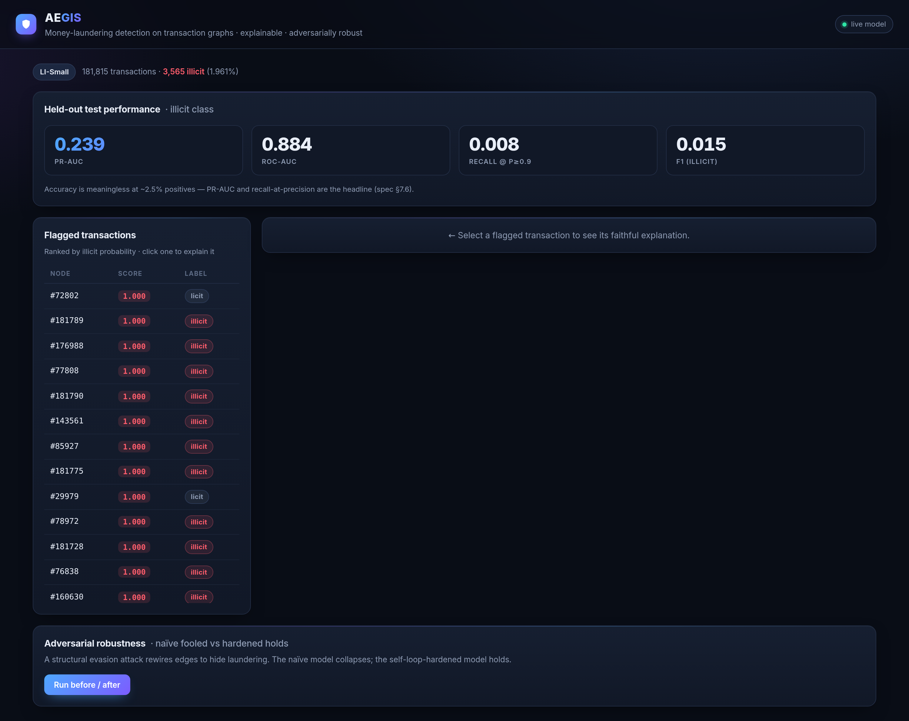
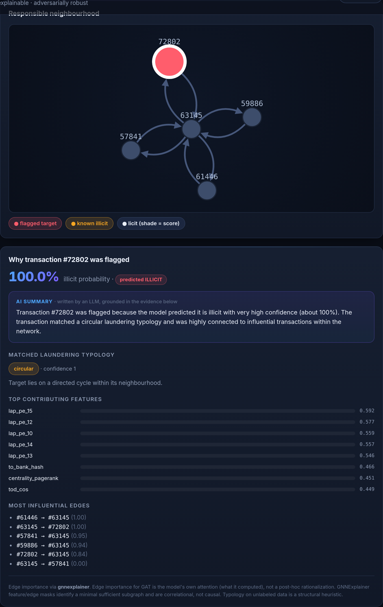
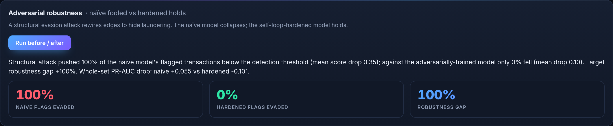
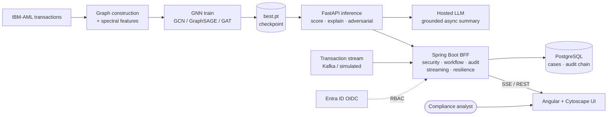

<div align="center">

# 🛡 AEGIS

### Adversarially-robust · Explainable · Graph-based Intelligence System

**Graph-neural-network detection of money-laundering patterns in transaction networks — with faithful explanations, a grounded LLM summary, and demonstrated adversarial robustness — served end-to-end through a Python / Java / Angular stack.**


### ▶ [Live demo](https://aegis-frontend.nicesea-483c92cd.norwayeast.azurecontainerapps.io)

<sub>Running on Azure Container Apps. Click a flagged transaction to see its responsible neighbourhood, faithful feature/edge attribution, and a grounded plain-English AI summary.</sub>

<sub>The demo runs **real model inference + explanation on demand** over a **prebuilt graph snapshot** of the IBM-AML LI-Small dataset — it is not (yet) streaming live transactions. Public endpoints are rate-limited.</sub>

</div>



---

## The problem

Money laundering rarely looks like a single bad transaction — it looks like a **shape in a network**: smurfing fan-outs, layering chains, circular flows. Per-transaction models miss these structures by construction. AEGIS models the transaction network as a graph and uses a **Graph Neural Network** to catch the patterns, then makes every flag **auditable** — because in a regulated domain, an unexplained alert is useless to a compliance officer.

## What it does

| Capability | How |
|---|---|
| **Graph-based detection** | GCN → GraphSAGE → GAT behind a common interface; transaction-as-node graph with Δt flow edges. |
| **Faithful explanations** | GNNExplainer over the node's **k-hop computation subgraph** (faithful for a k-layer GNN, ~1s instead of ~100s) + feature attribution + GAT attention, matched to a laundering **typology**, rendered as a capped neighbourhood graph. |
| **Grounded LLM summary** | An instruct LLM turns the explainer's evidence into plain English for an analyst — fed *only* the structured evidence + a feature glossary, so it can't invent reasons. Served **async** (graph is instant; summary writes in ~1–3s) via a hosted model, with a deterministic template fallback. |
| **Adversarial robustness** | A structural evasion attack fools a naïve model; a self-loop / adversarially-trained model **holds** — shown side by side. |
| **Honest evaluation** | Headline is **PR-AUC** and recall-at-precision, never accuracy (positives are ~0.05%). |
| **Real-time monitoring** | A streaming pre-screen (Spring Kafka, pluggable; simulated feed by default) scores transactions on arrival against a sliding **windowed account-graph**; fan-out/fan-in/high-value motifs raise alerts pushed **live to the UI over SSE**. |
| **Case-management workflow** | Alert → Case → Investigation → Disposition, governed by a **Spring State Machine**; analyst assignment, SLAs, full action history. **Segregation of duties** — only reviewers close a case. |
| **Tamper-evident audit** | Every decision is appended to a **hash-chained** trail; altering any past record breaks verification (EU AI Act traceability). |
| **Secured & resilient** | OAuth2/OIDC via **Entra ID** with role-based access (public read tier preserved); **Resilience4j** circuit-breaker/retry/bulkhead around the model; **Bucket4j** rate-limiting; **Java 21 virtual threads** for the fan-out. |
| **Production-shaped** | FastAPI inference · Spring Boot BFF (security, workflow, audit, streaming, persistence) · Angular UI — with OpenAPI, Prometheus metrics, ArchUnit, WireMock + Testcontainers tests. Not a notebook. |

## Screenshots

| Faithful explanation + grounded AI summary | Adversarial robustness |
|---|---|
|  |  |

## Architecture



**Why this shape:** the ML core (PyTorch/PyG) trains offline and emits a checkpoint; a thin **FastAPI** service owns model inference + explanations + the grounded summary; the **Spring Boot** BFF is the product platform — it secures access (Entra ID + RBAC), runs the real-time streaming pre-screen, drives the AML case-management workflow, writes the tamper-evident audit chain, and isolates the model behind circuit-breakers; the **Angular** UI is pure presentation (with a live SSE monitoring view). Each layer is independently replaceable.

## Results — real IBM-AML (LI-Small)

6.92M transactions, 3,565 illicit (**0.05%** base rate). On the held-out temporal test split:

| Metric | Value |
|---|---|
| **PR-AUC** | **0.239** (~9× the base rate) |
| **ROC-AUC** | **0.884** |

Honest findings (kept in the repo, not hidden): at a strict precision ≥ 0.9 the baseline's recall is ~0 (hard under this imbalance), and a GAT *without self-loops* collapses to ROC-AUC 0.57 on this fragmented graph (avg degree 0.14) because it discards isolated nodes' own features — re-enabling self-loops recovers 0.88. That same self-loop gap drives the adversarial demo.

## Run it locally

**Prerequisites:** Docker Desktop. (Optional, only if you want to retrain: Python 3.11.)

```bash
git clone https://github.com/BrageEilertsen/AEGIS.git && cd AEGIS

# 1. Fetch the trained model + pre-built graph (lean: ~700MB RAM, instant startup)
mkdir -p outputs/gcn_lismall
python3 -c "from huggingface_hub import hf_hub_download as d; import shutil; \
  shutil.copy(d('bragee/AEGIS','gcn-li-small/best.pt'),'outputs/gcn_lismall/best.pt'); \
  shutil.copy(d('bragee/AEGIS','gcn-li-small/prebuilt_graph.pt'),'outputs/gcn_lismall/prebuilt_graph.pt')"

# 2. Bring up the full stack
cd infra && cp .env.example .env
docker compose up --build          # UI → http://localhost:4200
```

That's Postgres + FastAPI inference (with the grounded summary model) + Spring Boot BFF + Angular UI, one command. To **retrain** instead, see [`ml/`](ml/) — `python ml/train.py --config experiments/gcn_lismall.yaml --out-dir outputs/gcn_lismall --feature-cache cache/features --seed 42`.

## Tech stack

**ML** PyTorch · PyTorch Geometric · scikit-learn · NetworkX  ·  **Serving** FastAPI · Uvicorn · Hugging Face inference (hosted LLM)  ·  **Backend** Java 21 (virtual threads) · Spring Boot 3 · Spring Security (OAuth2/OIDC, Entra ID) · Spring State Machine · Spring for Apache Kafka · Resilience4j · Bucket4j · JPA/Hibernate · PostgreSQL  ·  **Frontend** Angular 17 · Cytoscape.js · SSE · TypeScript  ·  **Quality** OpenAPI/Swagger · Micrometer/Prometheus · ArchUnit · WireMock · Testcontainers · JUnit 5  ·  **Infra** Docker Compose · Azure Container Apps · Azure Database for PostgreSQL · Bicep IaC · GitHub Actions → GHCR

## Repository map

| Path | Contents |
|---|---|
| `ml/` | PyTorch/PyG core — graph construction, spectral features, GCN/SAGE/GAT, training, eval, explainability, adversarial. |
| `inference/` | FastAPI service wrapping the checkpoint (`/score /flags /explain /metrics /adversarial`) + grounded LLM narration. |
| `api/` | Spring Boot BFF — security (Entra ID/RBAC), case-management workflow (state machine), tamper-evident audit, real-time stream engine, Resilience4j, rate-limiting, OpenAPI; controllers/services/repositories over PostgreSQL. |
| `frontend/` | Angular + Cytoscape.js UI — dashboard, explanation panel, capped subgraph, adversarial demo, live SSE monitoring. |
| `experiments/` | YAML configs — single source of truth per run. |
| `infra/` | Docker Compose stack + Azure deploy (`infra/azure` — Bicep IaC, deploy script). |

## What this project demonstrates

End-to-end ownership of a non-trivial, regulated-domain product:

- **Graph ML & trustworthy AI** — GNN detection, faithful explanations + grounded GenAI (EU AI Act relevant), adversarial robustness, honest evaluation.
- **Senior-level backend** — a real **AML platform**, not a wrapper: OAuth2/OIDC security with RBAC and segregation of duties, a Spring State Machine case-management workflow, a hash-chained tamper-evident audit trail, an event-driven real-time monitoring pipeline (Kafka + SSE), and the model isolated behind Resilience4j circuit-breakers on Java 21 virtual threads.
- **Engineering maturity** — OpenAPI, Prometheus metrics, ArchUnit architecture tests, WireMock + Testcontainers integration tests, RFC 7807 errors, IaC, CI.
- **Delivered** — the whole stack from PyTorch to a Java BFF to an Angular UI, containerised, on a CI pipeline, **running live on Azure**.

## Status & roadmap

- ✅ ML core, explainability, adversarial robustness, inference, grounded LLM summaries.
- ✅ Production backend — security (Entra ID/RBAC), AML case-management workflow, tamper-evident audit, real-time streaming monitoring, resilience/rate-limiting, OpenAPI/observability, ArchUnit/WireMock/Testcontainers tests.
- ✅ Azure deployment (Container Apps + Azure Database for PostgreSQL), **[live](https://aegis-frontend.nicesea-483c92cd.norwayeast.azurecontainerapps.io)**.
- 🔜 ML deepening — account-centric graph reconstruction (denser structure → higher PR-AUC), temporal GNNs, subgraph-level detection, counterfactual explanations.
