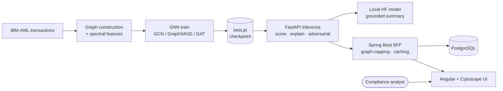

<div align="center">

# 🛡 AEGIS

### Adversarially-robust · Explainable · Graph-based Intelligence System

**Graph-neural-network detection of money-laundering patterns in transaction networks — with faithful explanations, a grounded LLM summary, and demonstrated adversarial robustness — served end-to-end through a Python / Java / Angular stack.**


</div>


---

## The problem

Money laundering rarely looks like a single bad transaction — it looks like a **shape in a network**: smurfing fan-outs, layering chains, circular flows. Per-transaction models miss these structures by construction. AEGIS models the transaction network as a graph and uses a **Graph Neural Network** to catch the patterns, then makes every flag **auditable** — because in a regulated domain, an unexplained alert is useless to a compliance officer.

## What it does

| Capability | How |
|---|---|
| **Graph-based detection** | GCN → GraphSAGE → GAT behind a common interface; transaction-as-node graph with Δt flow edges. |
| **Faithful explanations** | GNNExplainer minimal subgraph + feature attribution + GAT attention, matched to a laundering **typology**, rendered as a capped neighbourhood graph. |
| **Grounded LLM summary** | A small **local** HF model turns the explainer's evidence into plain English for an analyst — fed *only* the structured evidence, so it can't invent reasons. |
| **Adversarial robustness** | A structural evasion attack fools a naïve model; a self-loop / adversarially-trained model **holds** — shown side by side. |
| **Honest evaluation** | Headline is **PR-AUC** and recall-at-precision, never accuracy (positives are ~0.05%). |
| **Production-shaped** | FastAPI inference · Spring Boot BFF (graph-capping, caching, persistence) · Angular UI — not a notebook. |

## Screenshots

| Faithful explanation + grounded AI summary | Adversarial robustness |
|---|---|
|  |  |

## Architecture



**Why this shape:** the ML core (PyTorch/PyG) trains offline and emits a checkpoint; a thin **FastAPI** service owns model inference + explanations + the grounded summary; a **Spring Boot** BFF owns product logic (capping graphs to a renderable size, caching explanations in Postgres, orchestration); the **Angular** UI is pure presentation. Each layer is independently replaceable.

## Results — real IBM-AML (LI-Small)

6.92M transactions, 3,565 illicit (**0.05%** base rate). On the held-out temporal test split:

| Metric | Value |
|---|---|
| **PR-AUC** | **0.239** (~9× the base rate) |
| **ROC-AUC** | **0.884** |

Honest findings (kept in the repo, not hidden): at a strict precision ≥ 0.9 the baseline's recall is ~0 (hard under this imbalance), and a GAT *without self-loops* collapses to ROC-AUC 0.57 on this fragmented graph (avg degree 0.14) because it discards isolated nodes' own features — re-enabling self-loops recovers 0.88. That same self-loop gap drives the adversarial demo.

## Run it locally

**Prerequisites:** Docker Desktop. (Optional, only if you want to retrain: Python 3.11.)

```bash
git clone https://github.com/BrageEilertsen/AEGIS.git && cd AEGIS

# 1. Fetch the trained model + pre-built graph (lean: ~700MB RAM, instant startup)
mkdir -p outputs/gcn_lismall
python3 -c "from huggingface_hub import hf_hub_download as d; import shutil; \
  shutil.copy(d('bragee/AEGIS','gcn-li-small/best.pt'),'outputs/gcn_lismall/best.pt'); \
  shutil.copy(d('bragee/AEGIS','gcn-li-small/prebuilt_graph.pt'),'outputs/gcn_lismall/prebuilt_graph.pt')"

# 2. Bring up the full stack
cd infra && cp .env.example .env
docker compose up --build          # UI → http://localhost:4200
```

That's Postgres + FastAPI inference (with the grounded summary model) + Spring Boot BFF + Angular UI, one command. To **retrain** instead, see [`ml/`](ml/) — `python ml/train.py --config experiments/gcn_lismall.yaml --out-dir outputs/gcn_lismall --feature-cache cache/features --seed 42`.

## Tech stack

**ML** PyTorch · PyTorch Geometric · scikit-learn · NetworkX  ·  **Serving** FastAPI · Uvicorn · Hugging Face `transformers`  ·  **Backend** Java 21 · Spring Boot 3 · JPA / Hibernate · PostgreSQL  ·  **Frontend** Angular 17 · Cytoscape.js · TypeScript  ·  **Infra** Docker Compose · (Azure Container Apps — in progress)

## Repository map

| Path | Contents |
|---|---|
| `ml/` | PyTorch/PyG core — graph construction, spectral features, GCN/SAGE/GAT, training, eval, explainability, adversarial. |
| `inference/` | FastAPI service wrapping the checkpoint (`/score /flags /explain /metrics /adversarial`) + grounded LLM narration. |
| `api/` | Spring Boot BFF — controllers/services/repositories, RestClient to FastAPI, graph-capping, JPA. |
| `frontend/` | Angular + Cytoscape.js UI — dashboard, explanation panel, capped subgraph, adversarial demo. |
| `experiments/` | YAML configs — single source of truth per run. |
| `infra/` | Docker Compose stack (+ Azure deploy, in progress). |

## What this project demonstrates

End-to-end ownership of a non-trivial, regulated-domain ML product: graph ML, **trustworthy-AI** concerns (faithful explanations + grounded GenAI, relevant to the EU AI Act), adversarial robustness, honest evaluation, and the full delivery stack from PyTorch to a Java BFF to an Angular UI — containerised and cloud-ready.

## Status & roadmap

- ✅ Phases 1–7 — ML core, explainability, adversarial robustness, inference, BFF, frontend, Docker Compose.
- ✅ Grounded LLM explanation summaries.
- 🔜 Phase 8 — Azure deployment (Container Apps + Azure Database for PostgreSQL) for a live public demo.
